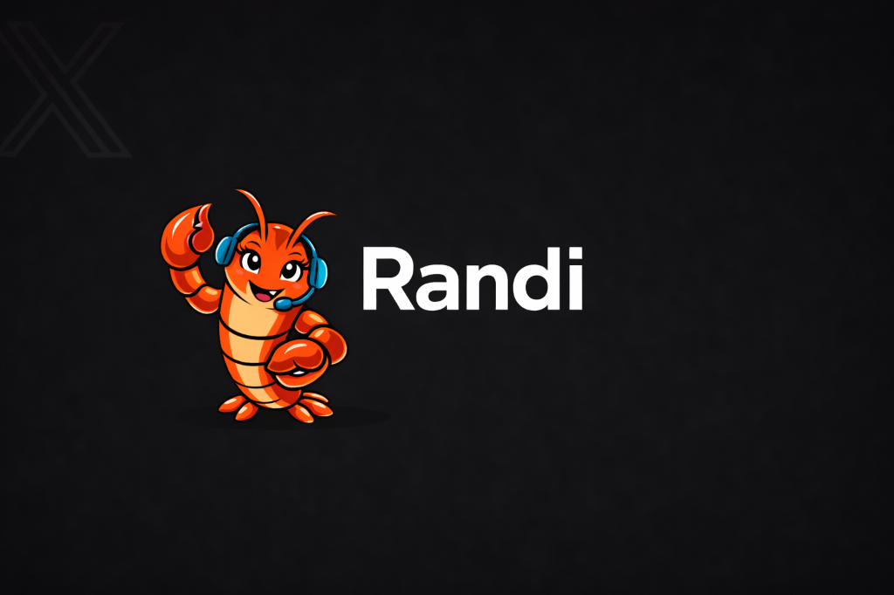

<div align="center">
  

  # 🤖 Randi Agent Platform
  
  **The enterprise-grade AI agent orchestration layer powered by Solana and Composio.**

  [](https://opensource.org/licenses/MIT)
  [](https://nextjs.org/)
  [](https://solana.com/)
  [](https://www.privy.io/)
  [](https://www.docker.com/)

  [Explore Docs](docs/USER_GUIDE.md) · [Report Bug](../../issues/new?template=bug_report.yml) · [Request Feature](../../issues/new?template=feature_request.yml)
</div>

---

## 🌟 Overview

Randi Agent is a powerful, token-powered AI agent platform designed for seamless orchestration, secure wallet authentication, and containerized agent execution. It bridges the gap between high-level AI workflows and low-level system integrations using **Composio** and **Solana**.

### 💎 Token Economy & Open Source

This project is built with a dual-purpose mission:
1.  **Hosted Platform**: We provide a managed version of this platform at [randi.chat](https://www.randi.chat/), funded and powered by the **$RANDI** token on Pump.fun. Holding and using $RANDI fuels the development and operations of the ecosystem.
2.  **Fully Self-Hostable**: In the spirit of true decentralization and open source, anyone can clone this repository and run their own instance of the Randi Agent platform for personal or enterprise use.

### 🛡️ The Randi Difference

Randi Agent was inspired by the rapid evolution of open-source AI frameworks like OpenClaw, but it adopts a fundamentally different, **security-first** approach:

*   **Hardened Isolation**: While many frameworks execute agent tools directly on the host system or in shared process spaces, Randi mandates the use of **isolated Docker containers** for every agent lifecycle. This ensures that even if an agent is compromised or behaves unexpectedly, the host infrastructure remains safe.
*   **Trustless Orchestration**: By strictly enforcing **Privy-only authentication**, we eliminate common auth "footguns" and ensure that agent fleet management is governed by hardware-secured wallet keys.
*   **Infrastructure over Interfaces**: Rather than just building a chat UI, Randi is designed as an **orchestration layer**. It focuses on the "plumbing"—fleet health, container recycling, and verified credit ledgers—needed to run AI agents at professional scale.

### 🚀 Key Features

- **🔐 Privy Auth Only**: Secure, web3-native authentication architecture using Privy (strictly enforced).
- **🔗 Composio Integration**: Out-of-the-box access to hundreds of tools and integrations for AI agents.
- **🏗️ Containerized Agents**: Launch agents in isolated Docker containers for maximum security and scalability.
- **💳 Credit System**: Token-gated access and credit management for agent usage.
- **💬 Real-time Chat**: Unified interface for interacting with launched agents.
- **⛓️ Solana Native**: Deep integration with Solana for payments ($RANDI token) and verified deposits.

---

## 🛠️ Current State & Progress

The platform is currently in **Phase 1: Foundation & Orchestration**.

- [x] **Core Architecture**: Next.js 15 frontend with Prisma/Supabase backend.
- [x] **Agent Lifecycle**: Docker orchestration for dynamic agent spawning.
- [x] **Auth Migration**: Successfully migrated to Privy as the sole sign-in provider.
- [x] **Solana Integration**: Verified deposit workflow and $RANDI burn schedules implemented.
- [ ] **Phase 2 (Upcoming)**: Enhanced agent memory layers and multi-agent coordination.

---

## 🚦 Quick Start

### Prerequisites

- Node.js 20+
- Docker (running)
- Solana Wallet

### Installation

1. **Clone and Install**
   ```bash
   git clone https://github.com/Randi-Agent/agent-platform.git
   cd agent-platform
   npm install
   ```

2. **Environment Setup**
   Copy `.env.example` to `.env.local` and fill in your credentials (Privy, Supabase, Solana RPC).

3. **Initialize Database**
   ```bash
   npx prisma generate
   npx prisma db push
   ```

4. **Launch Development Server**
   ```bash
   npm run dev
   ```

Open [http://localhost:3000](http://localhost:3000) to see the platform in action.

---

## 📦 Documentation

Deep dive into the architecture and workflows:

- 📖 **[User Guide](docs/USER_GUIDE.md)**: How to use the platform.
- 🛠️ **[Developer Guide](docs/PRIVATE_CODE_PUBLIC_SUPPORT_MIGRATION.md)**: Working with the codebase.
- 🚀 **[Deployment Runbook](DEPLOYMENT.md)**: AWS/EC2 rollout procedures.
- 💸 **[Payment Ops](PAYMENTS.md)**: Managing the $RANDI token economy.

---

## 🤝 Contributing

We love contributions! Please read our **[Contributing Guidelines](.github/CONTRIBUTING.md)** and **[Code of Conduct](.github/CODE_OF_CONDUCT.md)** before submitting a Pull Request.

---

## 🛡️ Security

If you discover a security vulnerability, please refer to our **[Security Policy](.github/SECURITY.md)**.

---

<div align="center">
  <sub>Built with ❤️ by the Randi Agent Team. &copy; 2026</sub>
  <br />
  <a href="https://t.me/RandiAgent">Join our Telegram</a>
</div>
